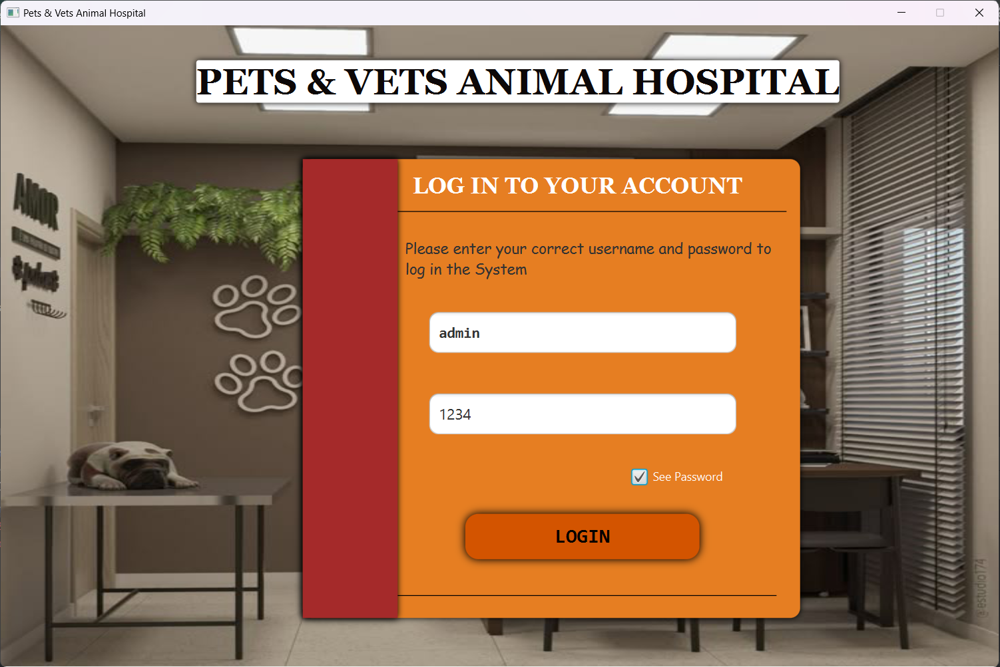
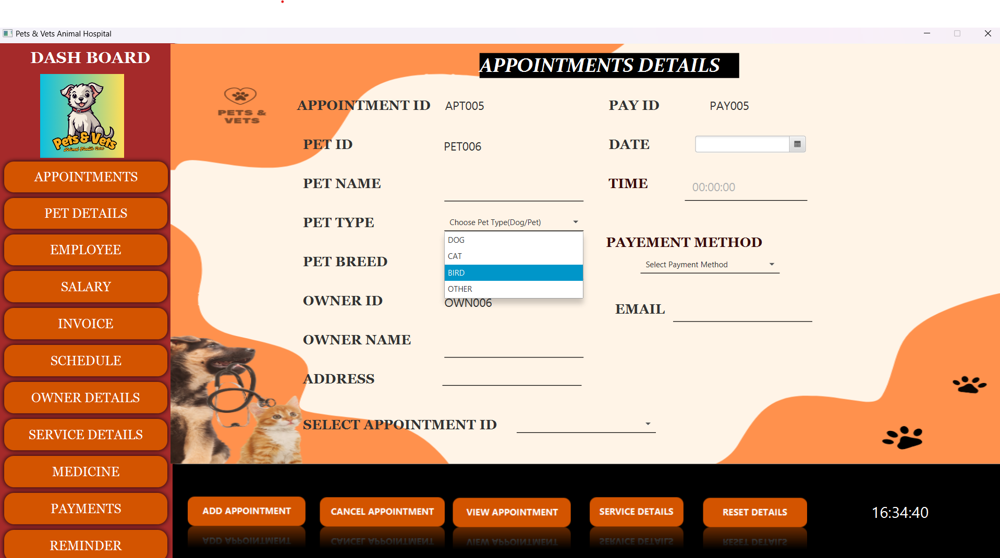
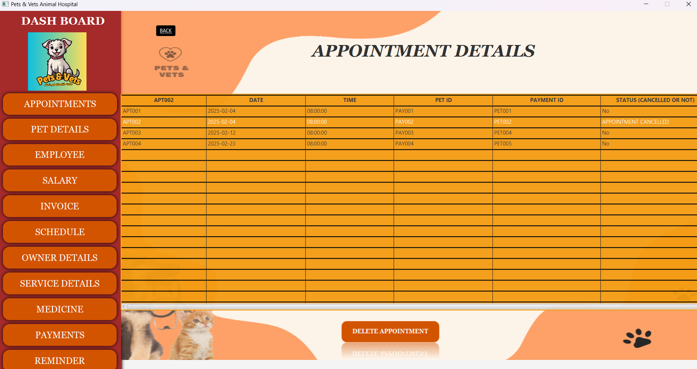
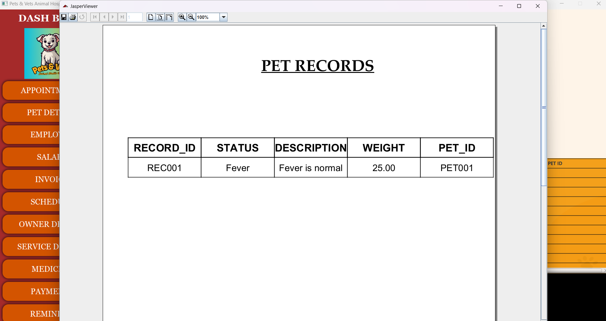
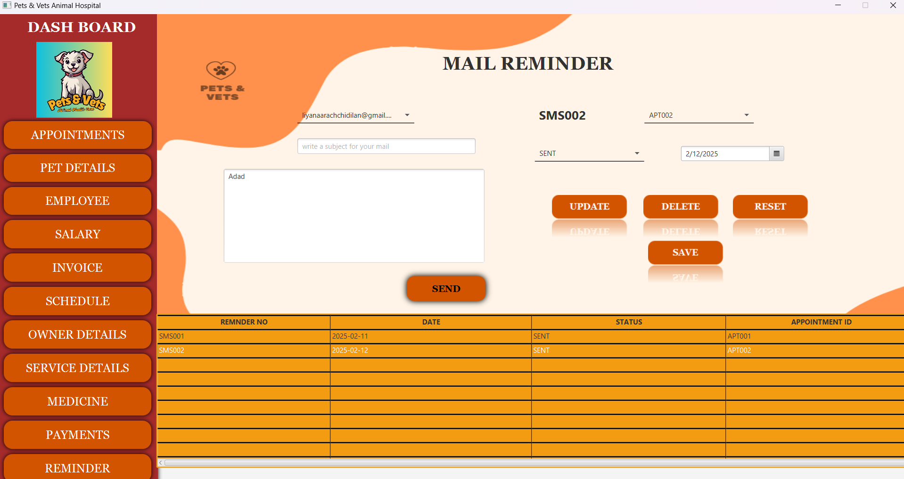

# 🐾 PetCare Management System

A simple, user-friendly application built on a layered architecture that helps manage pet care operations—tracking pets, owners, appointments, treatments, and payments.

---

## 🔍 Overview

The PetCare Management System enables efficient handling of:

- **Pet Profiles** – Add and view details about each pet (name, species, age, breed, etc.).
- **Owner Management** – Register and manage pet owners’ personal information.
- **Appointment Tracking** – Schedule and manage pet care visits (vaccinations, grooming, check-ups).
- **Treatment & Payment Records** – Log services provided and record payments and receipts.
---

## 🧩 Features

- **Layered Architecture** – Clean separation of concerns: DTOs, Business Logic, Data Access, presentation.
- **CRUD Operations** – Fully functional Create, Read, Update, and Delete operations for all core entities.
- **Balance Overview** – Automatically calculate and display payment status for each appointment or treatment.
- **Mail Sender** - Send a mail as a reminder for an appointment.
- **Reporting and analytics** - View and generate reports using jasper Soft studios

---

## 📸 Screenshots

| Feature               | Screenshot                          |
|-----------------------|--------------------------------------|
| Login Form            |      |
| Dashboard / Overview  |  |
| View Appointment 	|  |
| Jasper Reports        |   	 |
| Mails Sender	        |   	 |

---
Created by **[Dilan Liyanaarachchi]**, this project is intended for educational purposes and demonstrates effective use of well‑structured software design principles.

---

## 📞 Contact / Support

Feel free to reach out:

- **Email** – liyanaarachchidilan@gmail.com  
- **GitHub** – https://github.com/DiilaNa

---

*Thank you for exploring the PetCare Management System! 🐶🐱*
